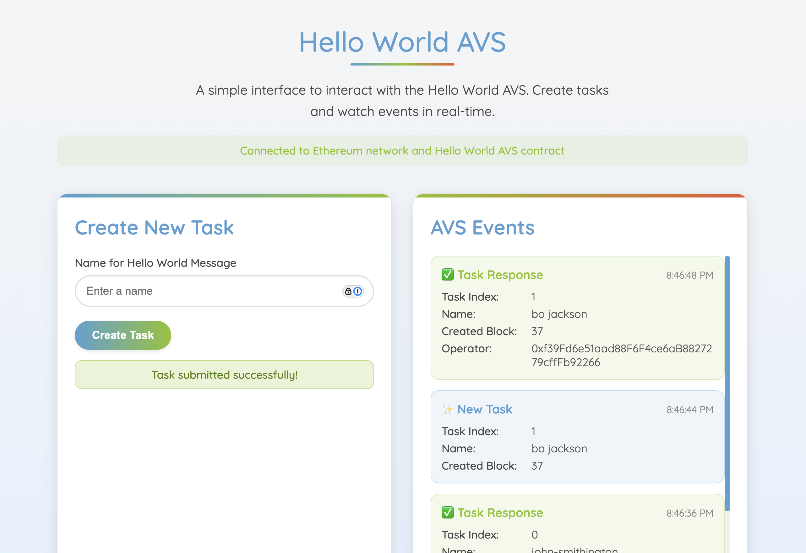
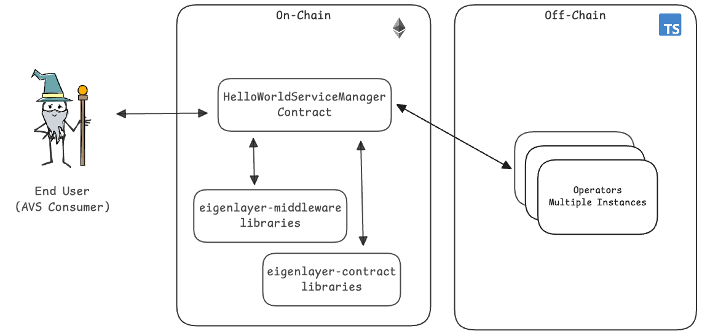

# Hello World AVS ~ Vibe Coded AVS Frontend ~

Welcome to the Hello World AVS fork with a vibe coded front end. Please see the video recording of this project [here](https://x.com/weswfloyd/status/1908267994033353206) and the parent project [here](https://github.com/Layr-Labs/hello-world-avs) for more background.

<div align="center">

</div>


## Architecture

<div align="center">

</div>

### AVS User Flow

1) AVS consumer requests a "Hello World" message to be generated and signed.
2) HelloWorld contract receives the request and emits a NewTaskCreated event for the request.
3) All Operators who are registered to the AVS and has staked, delegated assets takes this request. Operator generates the requested message, hashes it, and signs the hash with their private key.
4) Each Operator submits their signed hash back to the HelloWorld AVS contract.
5) If the Operator is registered to the AVS and has the minimum needed stake, the submission is accepted.

That's it. This simple flow highlights some of the core mechanics of how AVSs work.


## Development Environment

This section describes the tooling required for local development.


Install dependencies:

- [Node](https://nodejs.org/en/download/)
- [Typescript](https://www.typescriptlang.org/download)
- [ts-node](https://www.npmjs.com/package/ts-node)
- [tcs](https://www.npmjs.com/package/tcs#installation)
- [npm](https://docs.npmjs.com/downloading-and-installing-node-js-and-npm)
- [Foundry](https://getfoundry.sh/)
- [ethers](https://www.npmjs.com/package/ethers)


## Quick start (TypeScript)

### Start Anvil Chain

In terminal window #1, execute the following commands:

```sh

# Install npm packages
npm install

# Start local anvil chain
npm run start:anvil
```

### Deploy Contracts and Start Operator

Open a separate terminal window #2, execute the following commands

```sh
# Setup .env file
cp .env.example .env
cp contracts/.env.example contracts/.env

# Updates dependencies if necessary and builds the contracts 
npm run build:forge

# Deploy the EigenLayer contracts
npm run deploy:core

# Deploy the Hello World AVS contracts
npm run deploy:hello-world

# (Optional) Update ABIs
npm run extract:abis

# Start the Operator application
npm run start:operator
```

### Create Hello-World-AVS Tasks

Open a separate terminal window #3, execute the following commands

```sh
# Start the frontend
cd avs-frontend
npm install
npm start
```


## Help and Support

For help and support deploying and modifying this repo for your AVS, please:

1. Open a ticket via the intercom link at [support.eigenlayer.xyz](https://support.eigenlayer.xyz).
2. Include the necessary troubleshooting information for your environment:
  * Local anvil testing:
    * Redeploy your local test using `--revert-strings debug` flag via the following commands and retest: `npm run deploy:core-debug && npm run deploy:hello-world-debug`
    * Include the full stacktrace from your error as a .txt file attachment.
    * Create a minimal repo that demonstrates the behavior (fork or otherwise)
    * Steps require to reproduce issue (compile and cause the error)
  * Holesky testing:
    * Ensure contracts are verified on Holesky. Eg `forge verify-contract --chain-id 17000 --num-of-optimizations 200 src/YourContract.sol:YourContract YOUR_CONTRACT_ADDRESS`
    * Send us your transaction hash where your contract is failing. We will use Tenderly to debug (adjust gas limit) and/or cast to re-run the transaction (eg `cast call --trace "trace_replayTransaction(0xTransactionHash)"`).

## Contact Us

If you're planning to build an AVS and would like to speak with a member of the EigenLayer DevRel team to discuss your ideas or architecture, please fill out this form and we'll be in touch shortly: [EigenLayer AVS Intro Call](https://share.hsforms.com/1BksFoaPjSk2l3pQ5J4EVCAein6l)

## Disclaimers

- This repo is meant currently intended for _local anvil development testing_. Holesky deployment support will be added shortly.
- Users who wish to build an AVS for Production purposes will want to migrate from the `ECDSAServiceManagerBase` implementation in `HelloWorldServiceManager.sol` to a BLS style architecture using [RegistryCoordinator](https://github.com/Layr-Labs/eigenlayer-middleware/blob/dev/docs/RegistryCoordinator.md).

